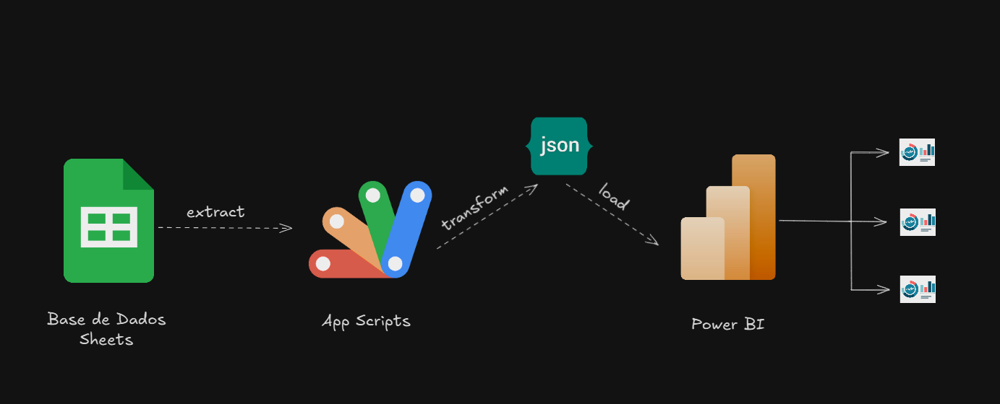

# Integração Google Sheets + Power BI com Google Apps Script

Este projeto permite a integração de dados do Google Sheets com Power BI por meio de um **endpoint personalizado** criado com Google Apps Script. O objetivo é expor dados em formato **JSON**, facilitando a conexão segura e performática com ferramentas de BI.

# 🗂️ Workflow

Abaixo, a representação do fluxo de integração entre o Google Sheets, Google Apps Script e Power BI:

- Atualização diária com trigger às 5h.
- Transformação dos dados no script.
- Carregamento via JSON no Power BI.
